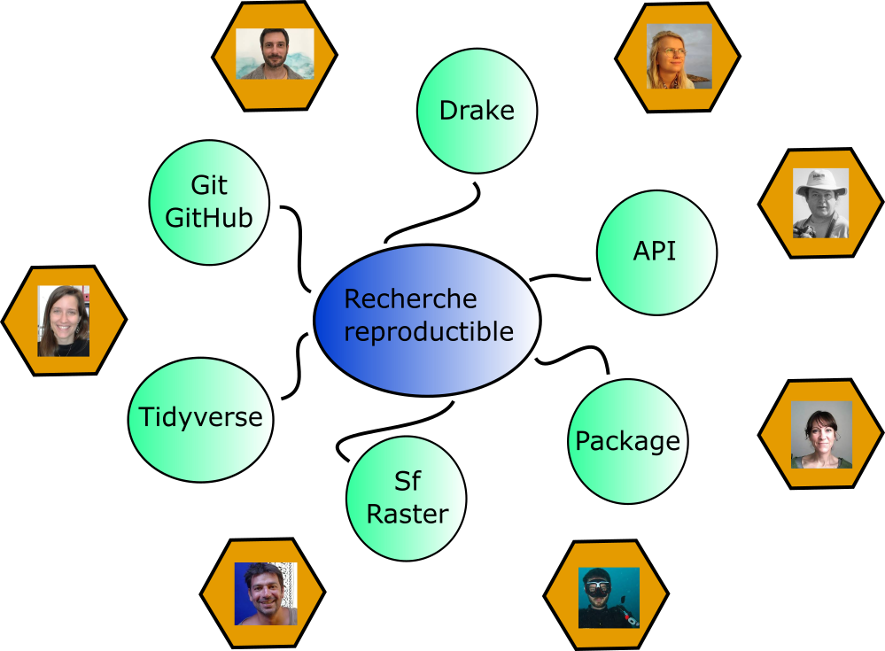

```{r setup, include=FALSE}
knitr::opts_chunk$set(echo = FALSE)
```

## les objectifs
* Faire la carte avec la répartition des espèces de chaque pays dans les différentes classes UICN  

* Utiliser le plus possible d'éléments abordés pendant la semaine:  
  + tidyverse et Rmarkdown  
  + sf pour les données spatiale
  + drake  
  + l'importation des données internet (API)   
  + **git et github**

---
## le graphique des dépendances
.center[]
  
---
## quelques retours "d'experience"
* git ne commut pas les dossiers vides.  
* le plan de drake est un data.frame, donc utiliser **=** pour objects=fonctions().  
* sourcer charge juste les fonctions (ne les applique pas). Il faut donc sourcer puis appliquer le plan dans le make.r.  

## le plan

---

---

## Les coupables

.center[]

## MERCI
