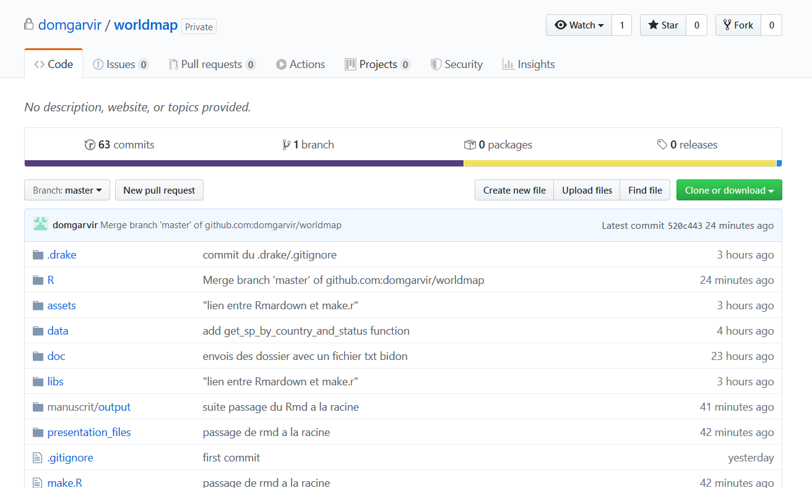
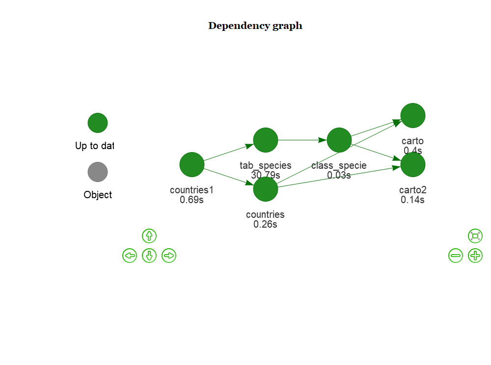

```{r setup, include=FALSE}
knitr::opts_chunk$set(echo = FALSE)
```

## les objectifs
* Faire la carte avec la répartition des espèces de chaque pays dans les différentes classes UICN  

* Utiliser divers éléments abordés pendant la semaine:  
  + tidyverse et Rmarkdown  
  + sf pour les données spatiale
  + drake  
  + l'importation de données internet (API)   
  + **git et github**

---
## On a puller puis pusher
.center[]

---
## le graphique des dépendances
.center[]

---
## une autre présentation possible
```{r}
config <- drake_config(plan)
vis_drake_graph(config, targets_only = TRUE)
```

---
## la première carte 

```{r , echo=FALSE, fig.cap= "Fig. 1",out.width="50%",fig.align='center'}
drake::readd(carto)
```

---
## quelques retours "d’expérience"
* git ne commut pas les dossiers vides.  
* le plan de drake est un data.frame, donc utiliser **=** pour objets=fonctions().  
* sourcer charge juste les fonctions (ne les applique pas).
* les problèmes de chemins entre drake et Rmardown nous ont contraint a mettre le .Rmd à la racine.

---

## Les coupables

.center[]

## MERCI
